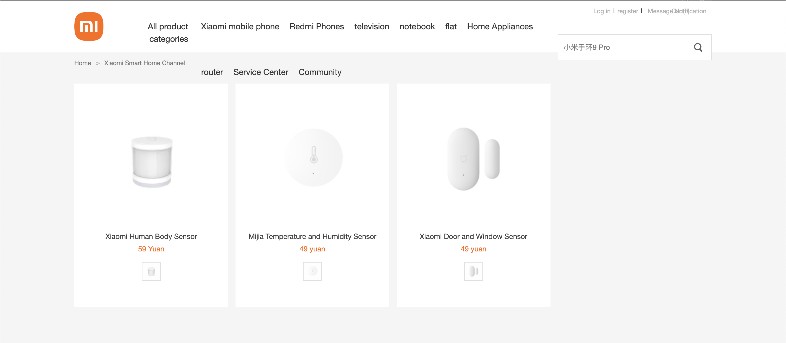

# OpenAurae v2

OpenAurae, created by [Michael Strauss](https://www.linkedin.com/in/michaelcstrauss/),
is a Monash University project to collect indoor environmental measurements for research and analysis.

The previous version (v1) was deployed as an AWS EKS cluster which was deprecated due to high maintenance cost.
For more information, please refer to the [code repository](https://bitbucket.org/monashaurae/aurae-web/src/master/),
which requires permission from the lab manager to access.

The current version declouds most components of the EKS cluster to local lab servers while implementing several
improvements:

- Redesigned user interface
- Significantly reduced latency of sensor reading queries across wide time ranges
- Added support for [NEMo devices](#nemo)

## Devices

A device is an IoT hardware unit equipped with sensors that collect environmental measurements.

### Air Quality Box

An air quality box includes a [PTQS1005](https://www.plantower.com/en/products_36/82.html) gas sensor
and a [PMS5003](https://www.plantower.com/en/products_33/74.html) PM2.5 sensor.
Sensors are connected to a [Raspberry Pi Zero](https://www.raspberrypi.com/products/raspberry-pi-zero/)
which runs a Python program to continuously send the latest measurements to the MQTT broker.

Note:

- it is impossible to add or remove sensors from an air quality box
- all PTQS1005 sensors share a common sensor ID (`ptqs1005`)
- all PMS5003 sensors share a common sensor ID (`pms5003st`)

### Zigbee Device



Xiaomi IoT sensors operate within a [Zigbee](https://en.wikipedia.org/wiki/Zigbee) network,
which employs a specialized protocol designed for low-power and low-bandwidth devices.
To capture and report sensor measurement messages in a Zigbee network,
[Zigbee2MQTT](https://www.zigbee2mqtt.io/guide/getting-started/) is used as an ear that can hear messages.

A Zigbee device is a RPi with a [wireless Zigbee adapter](https://www.aliexpress.com/item/1005001863186352.html)
connected.
It runs [Zigbee2MQTT](https://www.zigbee2mqtt.io/) so that Xiaomi sensors can be paired with the RPi and
all relevant messages will be sent to the MQTT broker.

Available types of Zigbee sensors are:

- Temperature
- Occupancy
- Contact
- Vibration
- Power

Note:

- sensors can be paired with or unpaired from Zigbee devices
- a Zigbee device can have multiple sensors of the same type

### NEMo

[NEMo devices](https://www.ethera-labs.com/en/air-quality-monitoring-station-nemo/), developed
by [Ethera](https://www.ethera-labs.com/en/),
are portable indoor air quality monitors installed in building 60 and 69 to monitor air quality in different rooms.
Since NEMo only send measurements to Ethera's server ([NEMo Cloud](https://www.nemocloud.com/)
and [NEMo Could S5](https://s5.nemocloud.com)),
the OpenAurae server must periodically fetch recent measurements to the local database.

Metrics collected by NEMo sensors:

- Formaldehyde (CH2O)
- CO2
- LVOC
- Temperature
- Relative Humidity
- Air Pressure
- NO2
- O3
- PM 1/2.5/10

## Readings

A reading is a record of sensor measurements at a specific moment.
Readings are retrieved in 2 ways:

1. subscribe to MQTT topics and parse messages from air quality boxes and Zigbee devices
2. call NEMo cloud API to query NEMo device measurements within a given time range

Readings may be adjusted by **corrections** (formulas such as `23.774*ch2o+57.093`) for better accuracy.

### Readings From MQTT Broker

The OpenAurae server subscribes to specific topics of the MQTT broker to receive sensor measurement messages (in JSON
format),
below is an example message from a PTQS1005 sensor.

```json
{
  "topic": "air-quality/pms",
  "sensor": "ptqs1005",
  "device_id": "b8:27:eb:6f:cd:af",
  "ip_address": "127.0.0.1",
  "latitude": 45.4,
  "longitude": 100.3,
  "tmp": 12.3,
  "rh": 12.3,
  "pm25": 12.3,
  "tvoc": 12.3,
  "co2": 12.3,
  "ch2o": 12.3,
  "time": "2019-01-01T18:44:19"
}

```

Once the server receives a message, it follows steps below to generate readings:

- validate message payload
- converting message to an unprocessed reading (no value is modified)
- generate a processed reading by
    - duplicate the unprocessed reading
    - apply related corrections
- insert both processed and unprocessed readings to the database

### Readings From NEMo Cloud

The server periodically follows steps below to fetch the latest readings:

- call `/session/login`
- get measure sets by calling `/measureSets` and specify device id, start time and end time
- for each measure set
    - get measures by calling `/measureSets/{measureSetBid}/measures`
    - for each measure (values of a single metric)
        - get measure values by calling `/measures/{measureBid}/values`
        - for each measure value
            - convert value to a partial reading record (only set PK and the metric field)
            - insert the record to the database (Scylla only updates non-null values)

